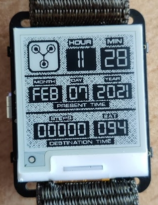

# David's watch faces

This project contains different watch-faces for the watchy from SQFMI and 
it also integrates the watchy into a smart-home via MQTT.

Some basic functionality is provided for all my watchfaces via the Watchy_Base class.
Namely, the buttons are used and an MQTT publisher is implemented such that 
you can send actions to other IOT devices using you watchy. Therefore, also 
the PubSubClient library must be installed within your Arduino environment.


## Watch faces
The following watch-faces are currently implemented:
- Step counter
- Jarvis
- Back to the future

Here you can see a picture of my back-to-the-future inspired watch face: <br/>


*Note: To change between different watch faces adapt the Watchy.ino file. Currently, only one watch face is loaded. In future I will implement it such that you can switch between my watch-faces during runtime. But currently this is not possible...*


## Smart-home integration
Please create a config.h file with the following definitions:
```
#define WIFI_SSID      "ENTER_HERE"
#define WIFI_PASS      "ENTER_HERE"

#define MQTT_BROKER    "ENTER_HERE"
#define MQTT_TOPIC     "ENTER_HERE"
#define MQTT_PAYLOAD   "ENTER_HERE"
```
This should ensure that you never make this information available through git.


# Acknowledgement
- Thanks a lot to SQFMI (https://github.com/sqfmi/Watchy) for this great project!
- https://github.com/BenjaminGabel/AnalogWatchFace